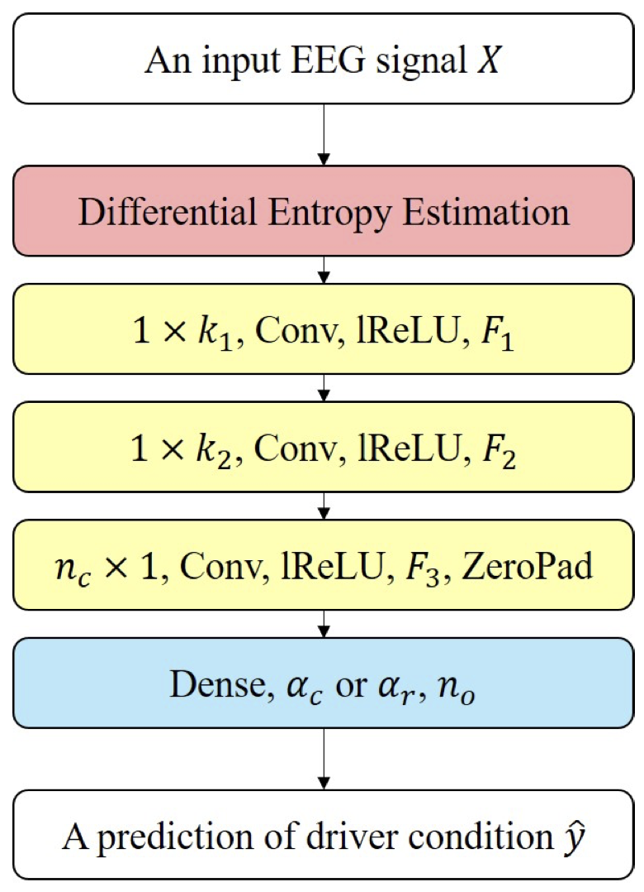

## VIGNet: A Deep Convolutional Neural Network for EEG-based Driver Vigilance Estimation
<p align="center"></p>

This repository provides a TensorFlow implementation of the following paper:
> **VIGNet: A Deep Convolutional Neural Network for EEG-based Driver Vigilance Estimation**<br>
> [Wonjun Ko](https://scholar.google.com/citations?user=Fvzg1_sAAAAJ&hl=ko&oi=ao)<sup>1</sup>, [Kwanseok Oh](https://scholar.google.com/citations?user=EMYHaHUAAAAJ&hl=ko)<sup>2</sup>, [Eunjin Jeon](https://scholar.google.com/citations?user=U_hg5B0AAAAJ&hl=ko)<sup>1</sup>, [Heung-Il Suk](https://scholar.google.co.kr/citations?user=dl_oZLwAAAAJ&hl=ko)<sup>1, 2</sup><br/>
> (<sup>1</sup>Department of Brain and Cognitive Engineering, Korea University) <br/>
> (<sup>2</sup>Department of Artificial Intelligence, Korea University) <br/>
> [[Official version]](https://ieeexplore.ieee.org/abstract/document/9061668)
> Presented in the 8th IEEE International Winter Conference on Brain-Computer Interface (BCI)
> 
> **Abstract:** *Estimating driver fatigue is an important issue for traffic safety and user-centered brain–computer interface. In this paper, based on differential entropy (DE) extracted from electroencephalography (EEG) signals, we develop a novel deep convolutional neural network to detect driver drowsiness. By exploiting DE of EEG samples, the proposed network effectively extracts class-discriminative deep and hierarchical features. Then, a densely-connected layer is used for the final decision making to identify driver condition. To demonstrate the validity of our proposed method, we conduct classification and regression experiments using publicly available SEED-VIG dataset. Further, we also compare the proposed network to other competitive state-of-the-art methods with an appropriate statistical analysis. Furthermore, we inspect the real-world usability of our method by visualizing a change in the probability of driver status and confusion matrices.*

## Dependencies
* [Python 3.6+](https://www.continuum.io/downloads)
* [TensorFlow 2.0.0+](https://www.tensorflow.org/)

## Downloading datasets
To download SEED-VIG dataset
* https://bcmi.sjtu.edu.cn/~seed/seed-vig.html

## Usage
`network.py` contains the proposed deep learning architectures, `utils.py` contains functions used for experimental procedures, and `experiment.py` contains the main experimental functions.

## Citation
If you find this work useful for your research, please cite our [paper](https://ieeexplore.ieee.org/abstract/document/9061668):
```
@inproceedings{ko2020vignet,
  title={Vignet: A deep convolutional neural network for eeg-based driver vigilance estimation},
  author={Ko, Wonjun and Oh, Kwanseok and Jeon, Eunjin and Suk, Heung-Il},
  booktitle={2020 8th International Winter Conference on Brain-Computer Interface (BCI)},
  pages={1--3},
  year={2020},
  organization={IEEE}
}
```

## Acknowledgements
This work was supported by the Institute of Information & Communications Technology Planning & Evaluation (IITP) grant funded by the Korea government (No. 2017-0-00451; Development of BCI based Brain and Cognitive Computing Technology for Recognizing User’s Intentions using Deep Learning).
